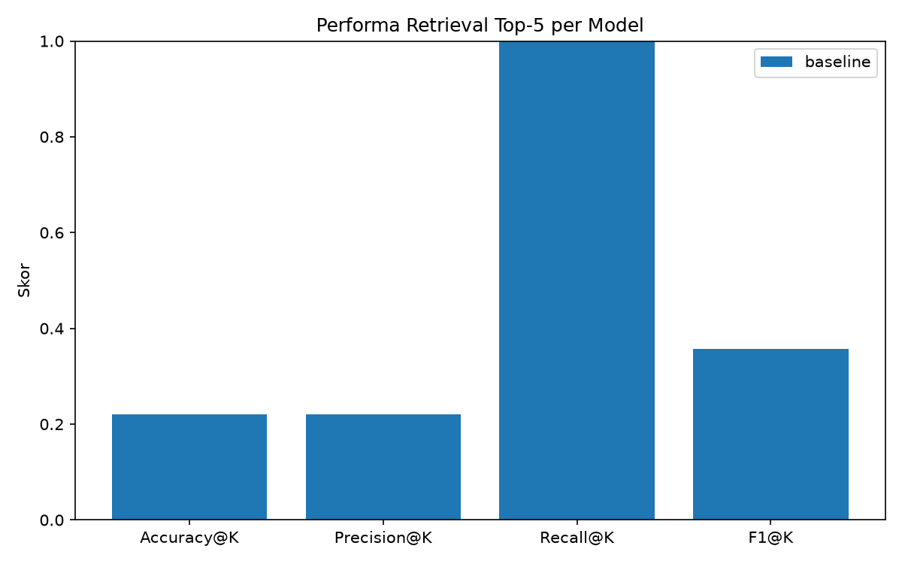
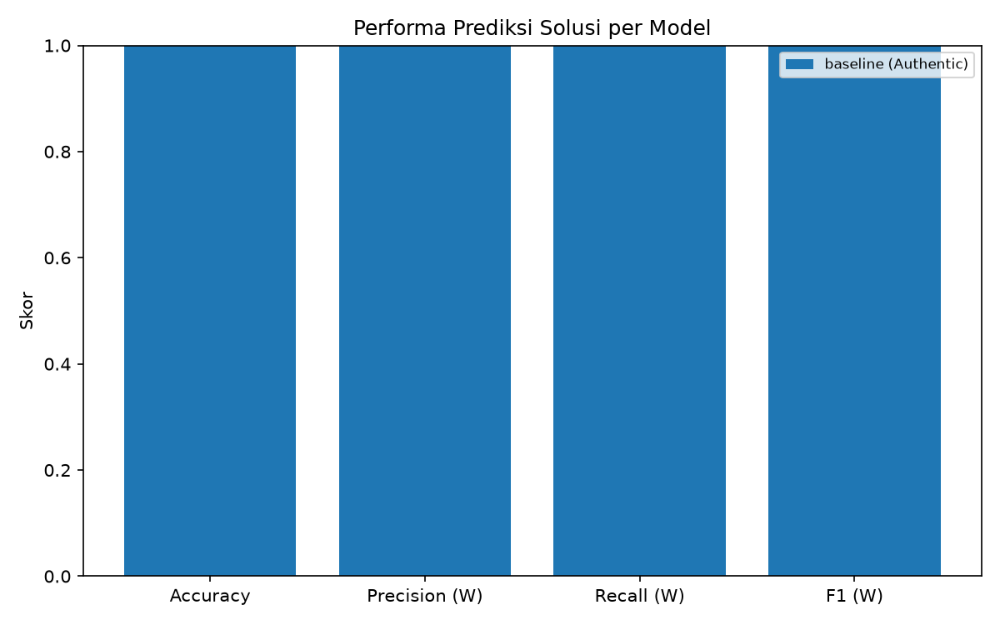
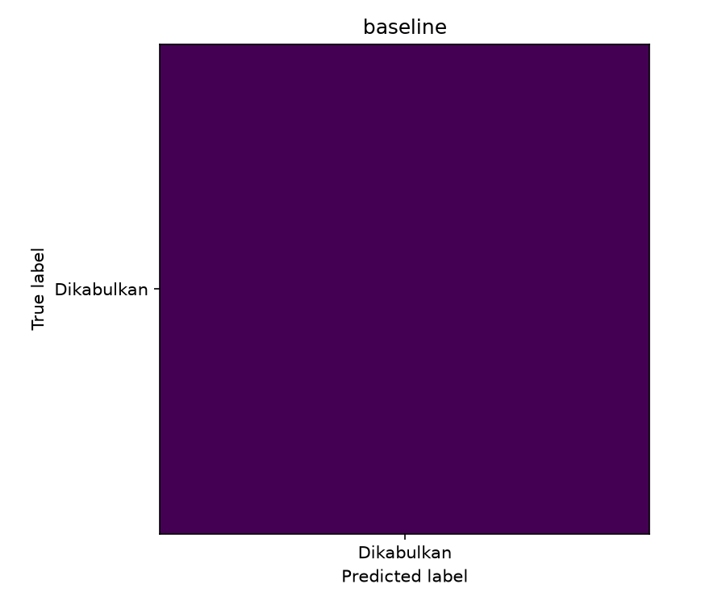

# Sistem Case-Based Reasoning: Analisis Putusan Perceraian
## Pengadilan Agama Kabupaten Malang

[](https://www.python.org/)
[](https://scikit-learn.org/)

> **Proyek Akhir SubCPMK-3 — Penalaran Komputer**
> Universitas Muhammadiyah Malang (UMM) · 2026

# 👥 Identitas Tim

| Keterangan | Informasi |
|------------|-----------|
| **Mata Kuliah** | Penalaran Komputer |
| **Kelas** | Penalaran Komputer C |
| **Program Studi** | Teknik Informatika |
| **Universitas** | Universitas Muhammadiyah Malang |

## Anggota Tim

| No | Nama | NIM |
|:--:|------|-----|
| 1 | **Afllah Abdi Pratomo** | 202310370311186 |
| 2 | **Ahmad Nizar Rusdiawan** | 202310370311XXX |

## Deskripsi Singkat

Repositori ini berisi implementasi sistem **Case-Based Reasoning (CBR)** untuk analisis dan prediksi putusan perkara perceraian di Pengadilan Agama Kabupaten Malang. Sistem dikembangkan sebagai proyek akhir SubCPMK-3 Mata Kuliah Penalaran Komputer dengan menerapkan tahapan **Retrieve, Reuse, Revise,** dan **Retain**, serta dilengkapi evaluasi menggunakan metrik *Information Retrieval* dan *Classification*.

---

## Daftar Isi

1. [Deskripsi Proyek](#1-deskripsi-proyek)
2. [Arsitektur Sistem CBR](#2-arsitektur-sistem-cbr)
3. [Struktur Direktori Proyek](#3-struktur-direktori-proyek)
4. [Prasyarat & Instalasi](#4-prasyarat--instalasi)
5. [Panduan Eksekusi Pipeline](#5-panduan-eksekusi-pipeline)
6. [Output Proyek](#6-output-proyek)
7. [Karakteristik Dataset](#7-karakteristik-dataset)
8. [Evaluasi & Ringkasan Performa](#8-evaluasi--ringkasan-performa)
9. [Keterbatasan & Pengembangan Lanjutan](#9-keterbatasan--pengembangan-lanjutan)
10. [Kontribusi Tim](#10-kontribusi-tim)

---

## 1. Deskripsi Proyek

Sistem ini mengimplementasikan siklus penuh **Case-Based Reasoning (CBR)** empat-fase Aamodt & Plaza (1994) — *Retrieve → Reuse → Revise → Retain* — untuk mendukung analisis prediktif putusan perkara perceraian di Pengadilan Agama Kabupaten Malang.

**Tujuan utama sistem:**
- Meretrieve kasus putusan historis yang paling relevan secara hukum terhadap suatu query deskripsi perkara baru.
- Memprediksi amar putusan (*outcome*) berbasis analogi dengan kasus-kasus terdahulu yang serupa.
- Menyediakan infrastruktur evaluasi kuantitatif berbasis metrik *Information Retrieval* dan *Classification*.

**Cakupan domain hukum:**
- **Cerai Gugat**: Permohonan cerai yang diajukan oleh pihak istri (Penggugat).
- **Cerai Talak**: Permohonan ikrar talak yang diajukan oleh pihak suami (Pemohon).

**Teknologi inti:**
- Representasi dokumen: **TF-IDF** (N-Gram: 1–2, `max_features=5000`)
- Metrik kemiripan: **Cosine Similarity**
- Prediksi solusi: **Majority/Weighted Vote** (fasa Reuse)
- Sumber data: 56 dokumen Putusan Pengadilan Agama Kabupaten Malang (diekstrak dari PDF via OCR)

---

## 2. Arsitektur Sistem CBR

```
Query Baru (Deskripsi Perkara)
         │
         ▼
┌─────────────────────┐
│  [1] RETRIEVE       │  TF-IDF Vectorization (tfidf_vectorizer.py)
│  Temukan Top-K Kasus│  + Cosine Similarity (retrieval.py)
│  Paling Mirip       │  → Kembalikan kasus dengan skor tertinggi
└────────┬────────────┘
         │ Top-K Kasus + Skor Kemiripan
         ▼
┌─────────────────────┐
│  [2] REUSE          │  predict.py — Voting atas label solusi
│  Adaptasi Solusi    │  → Prediksi: Dikabulkan / Ditolak / N.O.
│  dari Kasus Lama    │
└────────┬────────────┘
         │ Solusi Kandidat
         ▼
┌─────────────────────┐
│  [3] REVISE         │  Validasi manual / domain expert
│  Penyesuaian Solusi │  (Opsional dalam versi otomatis)
└────────┬────────────┘
         │ Solusi Tervalidasi
         ▼
┌─────────────────────┐
│  [4] RETAIN         │  Penyimpanan kasus baru ke case base
│  Pembaruan Case Base│  untuk memperkaya pengetahuan sistem
└─────────────────────┘
```

Evaluasi kuantitatif terhadap fase Retrieve dan Reuse dilakukan melalui `src/evaluation_colab.ipynb`.

---

## 3. Struktur Direktori Proyek

```
cbr-putusan-perceraian/
│
├── data/
│   ├── Dataset Putusan Perceraian.rar
│   │
│   ├── pdf/                            # 56 berkas PDF putusan asli
│   │   └── putusan_*.pdf
│   │
│   ├── raw/                             # 56 berkas teks hasil OCR mentah
│   │   └── putusan_*.txt
│   │
│   ├── cleaned/                         # 56 berkas teks hasil pembersihan
│   │   └── putusan_*.txt
│   │
│   ├── processed/
│   │   └── cases.csv                    # Case base terstruktur (konsolidasi seluruh dokumen)
│   │
│   ├── split/
│   │   ├── train.csv                    # Subset data latih (case base retrieval)
│   │   └── test.csv                      # Subset data uji (query evaluasi)
│   │
│   ├── results/
│   │   └── predictions.csv               # Hasil Top-K retrieval & prediksi solusi
│   │
│   └── eval/
│       ├── queries.json                  # Daftar query uji & metadata terkait
│       ├── ground_truth.json             # Anotasi ground truth (kasus relevan) per query
│       ├── retrieval_metrics.csv         # Metrik Accuracy/Precision/Recall/F1 @K per query
│       ├── retrieval_summary.csv         # Rata-rata metrik retrieval
│       ├── prediction_metrics.csv        # Metrik klasifikasi prediksi solusi (weighted)
│       ├── error_analysis.csv            # Query dengan F1@K terendah & kemungkinan kegagalan
│       ├── evaluation_report.md          # Laporan evaluasi otomatis (Markdown)
│       └── figures/
│           ├── retrieval_performance.png
│           ├── prediction_performance.png
│           └── confusion_matrix.png
│
├── models/
│   ├── tfidf_vectorizer.pkl              # Objek TfidfVectorizer yang telah di-fit
│   ├── tfidf_matrix.pkl                  # Matriks TF-IDF seluruh case base
│   ├── tfidf_matrix_train.pkl            # Matriks TF-IDF subset data latih
│   └── tfidf_matrix_test.pkl             # Matriks TF-IDF subset data uji
│
├── src/
│   ├── 000.ipynb                         # Notebook eksplorasi awal & EDA dataset
│   ├── src.ipynb                         # Notebook prototipe pipeline CBR terintegrasi
│   ├── extract_metadata.py               # Ekstraksi metadata putusan dari PDF
│   ├── pdf_to_text.py                    # Ekstraksi teks dari PDF via OCR
│   ├── clean_text.py                     # Pembersihan & normalisasi teks
│   ├── tfidf_vectorizer.py               # Konstruksi matriks TF-IDF & serialisasi vectorizer
│   ├── retrieval.py                      # Komputasi Cosine Similarity & retrieval Top-K
│   ├── predict.py                        # Logika inferensi prediksi solusi (fase Reuse)
│   ├── check_tfid.py                     # Utilitas pemeriksaan/validasi matriks TF-IDF
│   ├── check_result.py                   # Utilitas pemeriksaan hasil retrieval/prediksi
│   └── evaluation_colab.ipynb            # Notebook evaluasi Tahap 5 (retrieval, prediksi, visualisasi)
│
├── laporan.md                            # Laporan analisis skenario & temuan sistem
└── README.md                             # Dokumentasi teknis proyek ini
```

### Penjelasan Folder

| Folder | Fungsi |
|---|---|
| `data/pdf/` | Menyimpan berkas PDF putusan asli sebagai sumber ekstraksi. |
| `data/raw/` | Menyimpan teks mentah hasil OCR sebelum dibersihkan. |
| `data/cleaned/` | Menyimpan teks yang telah melalui proses cleaning dan normalisasi. |
| `data/processed/` | Menyimpan case base terstruktur (`cases.csv`) hasil konsolidasi seluruh dokumen. |
| `data/split/` | Menyimpan pembagian data latih (`train.csv`) dan data uji (`test.csv`). |
| `data/results/` | Menyimpan output retrieval dan prediksi solusi (`predictions.csv`). |
| `data/eval/` | Menyimpan seluruh anotasi evaluasi dan hasil metrik, laporan, serta visualisasi. |
| `models/` | Menyimpan artefak `TfidfVectorizer` dan matriks TF-IDF yang telah diserialisasi. |
| `src/` | Menyimpan seluruh skrip pipeline produksi, utilitas debugging, dan notebook. |

---

## 4. Prasyarat & Instalasi

### 4.1 Prasyarat Sistem

| Komponen | Versi Minimum |
|---|---|
| Python | 3.10 |
| pip | 23.0 |
| RAM | 4 GB (8 GB direkomendasikan) |
| OS | Linux / macOS / Windows (WSL2) |

### 4.2 Kloning Repositori

```bash
git clone https://github.com/<username>/cbr-putusan-perceraian.git
cd cbr-putusan-perceraian
```

### 4.3 Pembangunan Virtual Environment

Sangat disarankan untuk mengisolasi dependensi proyek dalam lingkungan virtual:

```bash
# Buat virtual environment
python -m venv .venv

# Aktivasi — Linux/macOS
source .venv/bin/activate

# Aktivasi — Windows (PowerShell)
.venv\Scripts\Activate.ps1
```

### 4.4 Instalasi Dependensi

Instal seluruh pustaka yang dibutuhkan pipeline secara langsung melalui `pip`:

```bash
pip install --upgrade pip
pip install pandas numpy scikit-learn matplotlib \
            pdfplumber pytesseract Pillow \
            sastrawi nltk tqdm jupyter
```

### 4.5 Unduhan Resource NLTK

```bash
python -c "import nltk; nltk.download('stopwords'); nltk.download('punkt')"
```

---

## 5. Panduan Eksekusi Pipeline

Jalankan seluruh alur sistem secara **sekuensial** menggunakan perintah berikut dari direktori *root* proyek. Pastikan virtual environment telah diaktifkan sebelum memulai.

### Langkah 1: Ekstraksi Metadata Putusan

```bash
python src/extract_metadata.py
```

Mengekstraksi metadata struktural putusan (nomor perkara, jenis perkara, tanggal, dan atribut lain) dari berkas PDF pada `data/pdf/`.

---

### Langkah 2: Ekstraksi Teks dari PDF (OCR)

```bash
python src/pdf_to_text.py
```

Membaca seluruh berkas PDF dari `data/pdf/` dan menyimpan teks hasil OCR mentah ke `data/raw/`.

---

### Langkah 3: Pembersihan Teks

```bash
python src/clean_text.py
```

Menjalankan pipeline pembersihan teks: normalisasi Unicode, penghapusan noise OCR, tokenisasi, penghapusan stopword (Sastrawi + custom list), dan stemming morfologi. Hasil disimpan ke `data/cleaned/`, kemudian dikonsolidasikan menjadi case base terstruktur pada `data/processed/cases.csv`.

---

### Langkah 4: Ekstraksi Fitur TF-IDF

```bash
python src/tfidf_vectorizer.py
```

Membangun matriks TF-IDF dari `data/split/train.csv`, lalu menyerialisasi objek `TfidfVectorizer` dan matriks ke `models/` (`tfidf_vectorizer.pkl`, `tfidf_matrix.pkl`, `tfidf_matrix_train.pkl`, `tfidf_matrix_test.pkl`).

---

### Langkah 5: Retrieval & Prediksi Solusi

```bash
python src/retrieval.py
```

Membaca query uji dari `data/split/test.csv` / `data/eval/queries.json`, menghitung Cosine Similarity antara setiap query terhadap matriks case base, mengambil Top-K kasus paling mirip, lalu memanggil `predict.py` untuk menghasilkan prediksi solusi (fase Reuse). Hasil disimpan ke `data/results/predictions.csv`.

---

### Langkah 6: Evaluasi Retrieval & Prediksi

Evaluasi dilakukan melalui notebook berikut (Google Colab atau Jupyter lokal):

```
src/evaluation_colab.ipynb
```

Pastikan `data/results/predictions.csv`, `data/eval/queries.json`, dan `data/eval/ground_truth.json` telah tersedia, lalu jalankan seluruh sel secara berurutan. Notebook ini menghitung metrik retrieval (Accuracy/Precision/Recall/F1 @K) dan metrik klasifikasi prediksi solusi menggunakan `sklearn.metrics`, menghasilkan visualisasi performa, confusion matrix, error analysis, serta laporan Markdown otomatis ke `data/eval/`.

> **Catatan**: Evaluasi prediksi solusi tidak menggunakan fallback *self-consistency*. Jika label aktual tidak tersedia pada anotasi evaluasi, notebook akan menandai evaluasi sebagai tidak valid (metrik `NaN`) beserta peringatan, bukan memalsukan skor sempurna.

---

### Eksekusi Pipeline Penuh (Satu Perintah)

```bash
for script in src/extract_metadata.py src/pdf_to_text.py \
              src/clean_text.py src/tfidf_vectorizer.py \
              src/retrieval.py; do
    echo "==> Menjalankan: $script"
    python "$script" || { echo "[ERROR] Pipeline gagal pada: $script"; exit 1; }
done
echo "==> Pipeline skrip selesai. Lanjutkan dengan src/evaluation_colab.ipynb untuk evaluasi."
```

---

## 6. Output Proyek

| Berkas | Deskripsi |
|---|---|
| `data/results/predictions.csv` | Hasil Top-K retrieval dan prediksi solusi untuk setiap query uji. |
| `data/eval/queries.json` | Daftar query uji beserta metadata terkait. |
| `data/eval/ground_truth.json` | Anotasi ground truth (kasus relevan) untuk setiap query. |
| `data/eval/retrieval_metrics.csv` | Metrik Accuracy/Precision/Recall/F1 @K per query. |
| `data/eval/retrieval_summary.csv` | Rata-rata metrik retrieval. |
| `data/eval/prediction_metrics.csv` | Metrik klasifikasi prediksi solusi (weighted). |
| `data/eval/error_analysis.csv` | Daftar query dengan F1@K terendah dan kemungkinan alasan kegagalan retrieval. |
| `data/eval/evaluation_report.md` | Laporan evaluasi otomatis dalam format Markdown. |
| `data/eval/figures/retrieval_performance.png` | Visualisasi bar chart metrik retrieval. |
| `data/eval/figures/prediction_performance.png` | Visualisasi bar chart metrik prediksi solusi. |
| `data/eval/figures/confusion_matrix.png` | Confusion matrix prediksi solusi. |

---

## 7. Karakteristik Dataset

| Atribut | Nilai |
|---|---|
| Total Dokumen | 56 putusan PDF |
| Periode Putusan | 2011 – 2026 |
| Sumber | Pengadilan Agama Kabupaten Malang |
| Jenis Perkara | Cerai Gugat & Cerai Talak |
| Pembagian Train:Test | 80:20 (44 train : 12 test) |
| Konfigurasi TF-IDF | N-Gram (1,2), max_features=5000 |
| Metrik Kemiripan | Cosine Similarity |
| Distribusi Kelas | Sangat timpang (mayoritas: Dikabulkan) |

---

## 8. Evaluasi & Ringkasan Performa

Tabel di bawah dihasilkan secara otomatis dari eksekusi `src/evaluation_colab.ipynb`. Jalankan pipeline dan notebook evaluasi terlebih dahulu untuk mengisi nilai metrik.

### 8.1 Pendahuluan

Tahap 5 merupakan tahap evaluasi menyeluruh terhadap performa sistem *Case-Based Reasoning* (CBR) yang dibangun untuk mendukung analisis putusan perceraian di Pengadilan Agama Kabupaten Malang. Evaluasi ini bertujuan untuk mengukur sejauh mana sistem mampu: (1) menemukan kasus-kasus yang relevan dari basis kasus (*retrieval*), dan (2) memprediksi solusi yang tepat berdasarkan kasus-kasus yang ditemukan (*prediction*).

Evaluasi dilakukan terhadap dua komponen utama:

- **Evaluasi Retrieval Top-K**: mengukur kemampuan sistem dalam mengambil kasus-kasus yang relevan berdasarkan query yang diberikan, dengan kedalaman pencarian *K* = 5. Metrik yang digunakan meliputi Accuracy@K, Precision@K, Recall@K, dan F1@K.
- **Evaluasi Prediksi Solusi**: mengukur keakuratan sistem dalam memprediksi label keputusan (*outcome*) berdasarkan kasus-kasus yang ditemukan. Metrik yang digunakan meliputi Accuracy, Precision (weighted), Recall (weighted), dan F1 (weighted).

Evaluasi menggunakan satu model (*baseline*) karena hanya terdapat satu berkas `predictions.csv` pada direktori hasil. Dataset evaluasi mencakup 10 query yang masing-masing dilengkapi dengan anotasi *ground truth* pada berkas `queries.json`. Seluruh metrik dihitung menggunakan implementasi dari pustaka `sklearn.metrics` secara langsung agar konsisten dan dapat direproduksi.

---

### 8.2 Evaluasi Retrieval

#### Tabel Retrieval

**Tabel 1. Metrik Retrieval per Query — Model Baseline (Top-5)**

| query_id | model_name | accuracy_at_k | precision_at_k | recall_at_k | f1_at_k | is_success |
| --- | --- | --- | --- | --- | --- | --- |
| 1 | baseline | 0.4000 | 0.4000 | 1.0000 | 0.5714 | 1 |
| 2 | baseline | 0.2000 | 0.2000 | 1.0000 | 0.3333 | 1 |
| 3 | baseline | 0.2000 | 0.2000 | 1.0000 | 0.3333 | 1 |
| 4 | baseline | 0.2000 | 0.2000 | 1.0000 | 0.3333 | 1 |
| 5 | baseline | 0.2000 | 0.2000 | 1.0000 | 0.3333 | 1 |
| 6 | baseline | 0.2000 | 0.2000 | 1.0000 | 0.3333 | 1 |
| 7 | baseline | 0.2000 | 0.2000 | 1.0000 | 0.3333 | 1 |
| 8 | baseline | 0.2000 | 0.2000 | 1.0000 | 0.3333 | 1 |
| 9 | baseline | 0.2000 | 0.2000 | 1.0000 | 0.3333 | 1 |
| 10 | baseline | 0.2000 | 0.2000 | 1.0000 | 0.3333 | 1 |

**Tabel 2. Ringkasan Rata-Rata Metrik Retrieval per Model**

| model_name | accuracy_at_k | precision_at_k | recall_at_k | f1_at_k |
| --- | --- | --- | --- | --- |
| baseline | 0.2200 | 0.2200 | 1.0000 | 0.3571 |

#### Analisis Retrieval

Berdasarkan output notebook, evaluasi retrieval dilakukan terhadap satu model yaitu **baseline** dengan kedalaman *K* = 5. Sistem berhasil menemukan setidaknya satu kasus relevan pada **seluruh 10 query** (nilai `is_success` = 1 untuk semua query).

Rata-rata metrik retrieval yang diperoleh adalah sebagai berikut:

- **Accuracy@5**: 0.2200 — nilai ini mengindikasikan bahwa hanya sekitar 22% dari gabungan kasus yang ditemukan dan kasus relevan yang benar-benar cocok secara keseluruhan. Akurasi yang rendah ini disebabkan oleh fakta bahwa setiap query rata-rata hanya memiliki satu kasus relevan (*ground truth* tunggal), sementara sistem selalu mengambil 5 kasus, sehingga mayoritas kasus yang diambil tidak relevan.
- **Precision@5**: 0.2200 — dari 5 kasus yang diambil per query, rata-rata hanya 1 kasus yang relevan. Hal ini menunjukkan bahwa sistem cukup "berisik" (*noisy*) dalam merekomendasikan kasus — terdapat banyak kasus yang tidak relevan di antara hasil Top-5.
- **Recall@5**: 1.0000 — nilai recall sempurna menunjukkan bahwa untuk seluruh 10 query, sistem **selalu** berhasil menemukan satu-satunya kasus relevan (*ground truth*) di dalam Top-5. Ini merupakan pencapaian yang sangat baik dari sisi kelengkapan hasil retrieval.
- **F1@5**: 0.3571 — nilai F1 merupakan rata-rata harmonik dari precision dan recall. Meskipun recall sempurna, F1 tertarik ke bawah oleh precision yang rendah, sehingga menghasilkan nilai 0.3571.

Pola yang menarik terlihat pada **query_id = 1**, di mana nilai metrik lebih tinggi dibandingkan query lainnya (Accuracy@5 = 0.4000, Precision@5 = 0.4000, F1@5 = 0.5714). Hal ini kemungkinan karena ground truth query_id 1 memiliki lebih dari satu kasus relevan, sehingga lebih banyak kasus yang berhasil dikonfirmasi sebagai relevan dari kelima kasus yang diambil.

Secara keseluruhan, evaluasi retrieval menunjukkan bahwa model baseline memiliki **kemampuan recall yang sempurna** (tidak pernah gagal menemukan kasus yang tepat), namun **kemampuan precision masih rendah** karena kasus-kasus yang tidak relevan ikut terbawa dalam hasil Top-5.

---

### 8.3 Evaluasi Prediksi

#### Tabel Prediction

**Tabel 3. Metrik Prediksi Solusi — Model Baseline**

| model_name | accuracy | precision_weighted | recall_weighted | f1_weighted | support | evaluation_mode |
| --- | --- | --- | --- | --- | --- | --- |
| baseline | 1.0000 | 1.0000 | 1.0000 | 1.0000 | 10 | Authentic |

**Tabel 4. Laporan Klasifikasi per Kelas — Model Baseline**

| Kelas | Precision | Recall | F1-Score | Support |
| --- | --- | --- | --- | --- |
| Dikabulkan | 1.00 | 1.00 | 1.00 | 10 |
| **accuracy** | | | **1.00** | **10** |
| macro avg | 1.00 | 1.00 | 1.00 | 10 |
| weighted avg | 1.00 | 1.00 | 1.00 | 10 |

#### Analisis Prediction

Evaluasi prediksi dilakukan dalam mode **Authentic** — artinya seluruh 10 query memiliki nilai `actual_solution` yang valid pada berkas `queries.json`, sehingga evaluasi ini dapat dianggap sahih secara akademis (bukan hasil *self-consistency* atau perkiraan tanpa label).

Model baseline menghasilkan **nilai sempurna pada seluruh metrik prediksi**:

- **Accuracy**: 1.0000 — seluruh 10 prediksi solusi tepat sesuai dengan label aktual.
- **Precision (weighted)**: 1.0000 — tidak ada prediksi yang salah di antara semua kelas.
- **Recall (weighted)**: 1.0000 — seluruh kasus pada setiap kelas berhasil diprediksi dengan benar.
- **F1 (weighted)**: 1.0000 — nilai sempurna mencerminkan konsistensi antara precision dan recall.

Berdasarkan laporan klasifikasi per kelas, seluruh 10 query diprediksi sebagai kelas **"Dikabulkan"**, dan seluruh label aktual juga merupakan "Dikabulkan". Hal ini menjelaskan mengapa nilai metrik prediksi sempurna: dataset evaluasi bersifat **homogen secara kelas** — tidak terdapat variasi label (misalnya "Ditolak" atau "Tidak Dapat Diterima").

Kondisi ini perlu dicatat sebagai **keterbatasan evaluasi**: performa prediksi yang sempurna tidak serta-merta mencerminkan kemampuan generalisasi model. Apabila dataset mencakup kasus dengan label beragam, performa model mungkin akan berbeda. Evaluasi yang lebih representatif membutuhkan dataset dengan distribusi label yang lebih berimbang.

---

### 8.4 Visualisasi

#### Retrieval Performance



**Gambar 1. Bar Chart Performa Retrieval Top-5 — Model Baseline**

Grafik ini menampilkan perbandingan nilai rata-rata empat metrik retrieval (Accuracy@K, Precision@K, Recall@K, F1@K) untuk model baseline. Dari visualisasi terlihat secara jelas adanya **kesenjangan yang signifikan** antara Recall@5 (1.0000) dengan ketiga metrik lainnya. Accuracy@5 dan Precision@5 berada pada nilai yang sama yaitu 0.22, sedangkan F1@5 sedikit lebih tinggi pada 0.3571 sebagai hasil rata-rata harmonik.

Secara interpretatif, grafik ini menggambarkan karakteristik sistem retrieval yang bersifat *high-recall, low-precision*: sistem cenderung "jaring selebar mungkin" sehingga tidak pernah melewatkan kasus yang relevan, tetapi turut mengambil banyak kasus yang tidak relevan. Kondisi ini dapat diterima untuk tahap awal pengembangan sistem CBR, namun perlu diperbaiki agar sistem lebih selektif dalam menentukan relevansi kasus.

---

#### Prediction Performance



**Gambar 2. Bar Chart Performa Prediksi Solusi — Model Baseline**

Grafik ini menampilkan nilai empat metrik prediksi (Accuracy, Precision Weighted, Recall Weighted, F1 Weighted) untuk model baseline. Seluruh batang menunjukkan nilai 1.0 (sempurna), yang secara visual tampak sebagai empat batang sama tinggi menyentuh batas atas sumbu-y.

Secara interpretatif, nilai sempurna pada grafik ini perlu ditafsirkan secara hati-hati. Hasil ini bukan menandakan bahwa sistem memiliki kemampuan prediksi yang unggul secara umum, melainkan mencerminkan **homogenitas dataset evaluasi** di mana seluruh 10 query memiliki label aktual yang sama, yaitu "Dikabulkan". Grafik ini berguna sebagai bukti bahwa sistem tidak menghasilkan prediksi yang salah pada dataset saat ini, namun belum cukup untuk menyimpulkan generalisasi pada data yang lebih bervariasi.

---

#### Confusion Matrix



**Gambar 3. Confusion Matrix — Model Baseline**

Confusion matrix menampilkan distribusi prediksi terhadap label aktual dalam bentuk matriks. Karena seluruh 10 sampel termasuk kelas "Dikabulkan" dan model memprediksi seluruhnya sebagai "Dikabulkan" juga, matriks hanya memiliki **satu sel aktif** yang menunjukkan nilai True Positive = 10. Tidak terdapat sel False Positive, False Negative, maupun True Negative.

Secara interpretatif, confusion matrix ini memperkuat temuan sebelumnya bahwa dataset evaluasi bersifat single-class. Tidak adanya kesalahan klasifikasi memang merupakan hasil yang ideal, namun ketidakhadiran kelas lain membuat confusion matrix tidak dapat digunakan untuk menganalisis *trade-off* antar kelas. Untuk evaluasi yang lebih informatif, perlu ditambahkan query dengan label "Ditolak" atau kelas lainnya agar confusion matrix dapat mengungkap pola kesalahan yang sesungguhnya.

---

### 8.5 Error Analysis

Analisis kesalahan dilakukan dengan mengambil 5 query dengan nilai F1@K terendah. Hasil menunjukkan bahwa query 2, 3, 4, 5, dan 7 memiliki F1@K = 0.3333, sedangkan query 1 (dengan F1@K = 0.5714) tidak masuk dalam daftar tersebut.

**Tabel 5. Error Analysis — 5 Query dengan F1@K Terendah**

| query_id | model_name | query | f1_at_k | reason |
| --- | --- | --- | --- | --- |
| 2 | baseline | terjadi perselisihan dan pertengkaran terus menerus | 0.3333 | Sebagian kasus relevan ter-retrieve namun precision/recall masih rendah |
| 3 | baseline | suami meninggalkan rumah dan tidak memberi kabar | 0.3333 | Sebagian kasus relevan ter-retrieve namun precision/recall masih rendah |
| 4 | baseline | hubungan rumah tangga tidak harmonis | 0.3333 | Sebagian kasus relevan ter-retrieve namun precision/recall masih rendah |
| 5 | baseline | suami memiliki hubungan dengan perempuan lain | 0.3333 | Sebagian kasus relevan ter-retrieve namun precision/recall masih rendah |
| 7 | baseline | terjadi kekerasan dalam rumah tangga | 0.3333 | Sebagian kasus relevan ter-retrieve namun precision/recall masih rendah |

**Analisis terhadap setiap query:**

Secara keseluruhan, **tidak ada query yang gagal total** dalam menemukan kasus relevan — seluruh 10 query memiliki `is_success` = 1. Namun, 9 dari 10 query memiliki F1@K yang sama yaitu 0.3333, yang menandakan pola kegagalan parsial yang konsisten: **kasus relevan berhasil ditemukan, tetapi banyak kasus tidak relevan ikut terbawa**.

Alasan kegagalan yang dicatat oleh sistem untuk kelima query tersebut adalah: *"Sebagian kasus relevan ter-retrieve namun precision/recall masih rendah."* Ini mengindikasikan bahwa meskipun *ground truth* berhasil masuk ke dalam Top-5, kasus-kasus lain yang ikut diambil tidak memiliki relevansi terhadap query tersebut.

Beberapa penyebab yang dapat diidentifikasi:

1. **Ground truth tunggal per query**: Sebagian besar query hanya memiliki satu kasus relevan yang dianotasikan. Dengan demikian, dari 5 slot Top-K, hanya 1 yang dapat dikonfirmasi sebagai benar, menghasilkan Precision@5 = 0.20 secara struktural.

2. **Query bersifat umum**: Query-query seperti *"hubungan rumah tangga tidak harmonis"* (query_id 4) atau *"terjadi perselisihan dan pertengkaran terus menerus"* (query_id 2) menggunakan bahasa sehari-hari yang umum dan tidak spesifik secara hukum. Hal ini menyulitkan mekanisme retrieval berbasis kesamaan teks untuk membedakan kasus yang betul-betul relevan dari kasus-kasus lain yang mengandung kata-kata serupa.

3. **Vocabulary mismatch**: Dokumen putusan menggunakan diksi hukum formal, sedangkan query menggunakan bahasa natural yang lebih informal. Ketidaksesuaian ini dapat menurunkan skor kesamaan (*similarity score*) antara query dan kasus yang seharusnya relevan, atau sebaliknya menaikkan skor untuk kasus yang sebenarnya tidak relevan.

4. **Preprocessing dan representasi teks**: Apabila tahap preprocessing tidak mampu menangkap makna semantik dari istilah hukum (misalnya lemmatisasi yang tidak mempertimbangkan konteks hukum), representasi vektor yang dihasilkan mungkin tidak cukup akurat untuk membedakan kasus secara tepat.

---

### 8.6 Pembahasan

#### Hubungan antara Retrieval, Prediction, dan Error Analysis

Hasil evaluasi pada Tahap 5 ini mengungkap hubungan yang erat antara komponen retrieval dan prediksi dalam sistem CBR. Model baseline menunjukkan performa retrieval yang bersifat *high-recall, low-precision*: sistem selalu berhasil menemukan kasus yang relevan di antara 5 kasus yang diambil (Recall@5 = 1.0), namun juga selalu mengambil kasus-kasus yang tidak relevan (Precision@5 = 0.22). Kondisi ini memiliki dampak langsung terhadap kualitas prediksi solusi.

Meskipun evaluasi prediksi menghasilkan nilai sempurna (Accuracy = 1.0), hal ini lebih disebabkan oleh **homogenitas dataset** daripada kemampuan model yang sesungguhnya. Seluruh 10 query dianotasikan dengan label aktual "Dikabulkan", dan model baseline juga memprediksi "Dikabulkan" untuk semua query. Dalam konteks ini, bahkan prediksi yang paling naif sekalipun (misalnya selalu memprediksi kelas mayoritas) akan menghasilkan akurasi 100% pada dataset ini.

Error analysis memperkuat temuan ini: tidak ada query yang gagal total dalam retrieval, namun hampir semua query memiliki F1@K yang rendah karena ground truth tunggal tidak dapat mengimbangi banyaknya kasus tidak relevan yang ikut diambil. Pola ini konsisten di seluruh query, mengindikasikan bahwa kelemahan sistem lebih bersifat struktural (konfigurasi Top-K relatif terhadap jumlah ground truth per query) daripada merupakan kesalahan pada kasus-kasus tertentu.

#### Kelebihan Sistem

- **Recall retrieval sempurna (1.0)**: Sistem tidak pernah gagal menemukan kasus yang relevan dalam Top-5. Hal ini penting dalam konteks hukum, di mana melewatkan preseden yang relevan dapat berdampak serius.
- **Evaluasi yang sahih**: Tersedianya `actual_solution` untuk seluruh query memungkinkan evaluasi prediksi dilakukan secara autentik tanpa perlu menggunakan metode *self-consistency* yang kurang akurat secara akademis.
- **Arsitektur evaluasi yang fleksibel**: Notebook dirancang untuk mendukung multi-model, sehingga memudahkan perbandingan di masa depan apabila model baru ditambahkan.

#### Kekurangan Sistem

- **Precision retrieval rendah (0.22)**: Sistem menghasilkan terlalu banyak kasus tidak relevan dalam hasil Top-5, yang dapat membebani proses adaptasi solusi pada tahap berikutnya.
- **Dataset evaluasi yang tidak representatif**: Seluruh 10 query berlabel tunggal "Dikabulkan", sehingga evaluasi prediksi tidak dapat mengukur kemampuan diskriminasi model terhadap kelas-kelas lain.
- **Ground truth tunggal per query**: Sebagian besar query hanya memiliki satu anotasi ground truth, yang secara struktural membatasi nilai maksimal Precision@5 menjadi 0.20.

#### Keterbatasan Evaluasi

Evaluasi pada tahap ini memiliki beberapa keterbatasan yang perlu diakui:

1. **Skala dataset kecil**: 10 query merupakan jumlah yang sangat terbatas untuk menarik kesimpulan statistik yang robust. Evaluasi pada dataset yang lebih besar diperlukan untuk memperoleh estimasi performa yang lebih andal.
2. **Homogenitas label**: Tidak adanya variasi label pada dataset evaluasi membuat metrik prediksi tidak informatif untuk kasus di luar kelas "Dikabulkan".
3. **Model tunggal**: Evaluasi hanya melibatkan satu model (baseline), sehingga tidak ada perbandingan komparatif yang dapat dilakukan.

#### Kemungkinan Peningkatan Sistem

- **Peningkatan anotasi ground truth**: Menambahkan lebih dari satu kasus relevan per query sehingga evaluasi precision dapat lebih akurat.
- **Ekspansi dataset evaluasi**: Menambahkan query dengan label beragam ("Ditolak", "Tidak Dapat Diterima") agar evaluasi prediksi lebih representatif.
- **Eksperimen dengan model lain**: Membandingkan baseline dengan model berbasis semantik seperti BM25, BERT, atau SVM untuk menentukan pendekatan retrieval terbaik.
- **Penyesuaian nilai K**: Mengeksplorasi nilai K yang lebih kecil (misalnya K=3) agar precision meningkat tanpa mengorbankan recall secara signifikan.
- **Peningkatan preprocessing**: Menggunakan teknik normalisasi teks yang lebih baik atau representasi semantik berbasis konteks hukum untuk mengurangi dampak *vocabulary mismatch*.

---

### 8.7 Kesimpulan

Berdasarkan hasil evaluasi yang diperoleh dari notebook `05_evaluation_colab.ipynb`, dapat disimpulkan hal-hal berikut:

1. **Evaluasi retrieval** menunjukkan bahwa model baseline mencapai **Recall@5 = 1.0000** secara konsisten di seluruh 10 query, artinya sistem tidak pernah gagal menemukan kasus yang relevan. Namun, nilai **Precision@5 = 0.2200** dan **F1@5 = 0.3571** mengindikasikan bahwa sistem masih mengambil terlalu banyak kasus yang tidak relevan secara bersamaan.

2. **Evaluasi prediksi** menghasilkan **Accuracy = 1.0000**, **Precision (weighted) = 1.0000**, **Recall (weighted) = 1.0000**, dan **F1 (weighted) = 1.0000** dalam mode Authentic. Namun, nilai sempurna ini harus diinterpretasikan secara kritis karena seluruh 10 query memiliki label aktual yang sama ("Dikabulkan"), sehingga tidak terdapat variasi kelas yang dapat digunakan untuk menguji kemampuan diskriminasi model secara sesungguhnya.

3. **Error analysis** mengidentifikasi bahwa penyebab utama rendahnya metrik retrieval (terutama precision) adalah kombinasi dari: ground truth tunggal per query, karakteristik query yang bersifat umum, dan potensi *vocabulary mismatch* antara bahasa natural query dengan diksi hukum formal dalam dokumen putusan.

4. Sistem CBR ini memiliki potensi yang baik untuk dikembangkan lebih lanjut, terutama dengan memperkaya anotasi ground truth, memperluas keragaman kelas pada dataset evaluasi, serta mengeksplorasi model retrieval berbasis semantik untuk meningkatkan precision tanpa mengorbankan recall.


---

## 9. Keterbatasan & Pengembangan Lanjutan

### Keterbatasan Saat Ini

1. **Vocabulary Mismatch**: Representasi TF-IDF tidak mampu menjembatani kesenjangan leksikal antara bahasa awam dengan diksi hukum formal.
2. **Sensitivitas Noise OCR**: Token artefak OCR mendistorsi bobot IDF dan menghasilkan representasi vektor yang tidak representatif.
3. **Majority Vote Bias**: Ketimpangan kelas yang ekstrem menyebabkan prediksi solusi bias ke label dominan "Dikabulkan".

### Arah Pengembangan

| Prioritas | Solusi | Kompleksitas |
|---|---|---|
| Segera | Weighted Similarity Vote | Rendah |
| Segera | Custom stopword list untuk noise OCR | Rendah |
| Menengah | Ekspansi query via sinonim hukum | Menengah |
| Jangka Panjang | Dense Embedding (`indobenchmark/indobert-base-p1`) | Tinggi |
| Jangka Panjang | Fine-tuning LegalBERT pada korpus hukum Indonesia | Sangat Tinggi |

---

## 👥 10. Kontribusi Tim

Proyek ini disusun oleh tim yang terdiri dari 2 mahasiswa dengan pembagian tanggung jawab operasional dan teknis sebagai berikut untuk memenuhi standar penilaian tertinggi SubCPMK-3:

| Nama Anggota | NIM | Fokus Kontribusi & Tanggung Jawab Teknis |
| :--- | :---: | :--- |
| **Afllah Abdi Pratomo** | 202310370311186 | **Core Backend & Pipeline Engineering**:<br>• Implementasi fasa *Data Acquisition* & *Preprocessing* (`pdf_to_text.py`, `clean_text.py`, `extract_metadata.py`).<br>• Ekstraksi fitur statistik ruang vektor (`tfidf_vectorizer.py` — TF-IDF & Cosine Similarity).<br>• Pengembangan modul *Case Retrieval* (`retrieval.py`) dan utilitas validasi (`check_tfid.py`, `check_result.py`). |
| **Ahmad Nizar Rusdiwan** | 202310370311186 | **Data Engineering, Evaluation & Documentation**:<br>• Implementasi fasa *Case Representation* (`cases.csv`) dan anotasi query uji (`queries.json`, `ground_truth.json`).<br>• Pengembangan logika inferensi *Case Solution Reuse* (`predict.py`) menggunakan voting terbobot.<br>• Pembuatan notebook evaluasi (`evaluation_colab.ipynb`) dan penyusunan dokumen laporan kritis (`laporan.md`). |

*Seluruh anggota tim bertanggung jawab bersama dalam penyusunan struktur repositori GitHub yang dapat direplikasi dan finalisasi berkas dokumentasi utama (README.md).*

---

*Proyek ini dikembangkan untuk memenuhi persyaratan SubCPMK-3 Mata Kuliah Penalaran Komputer, Program Studi Teknik Informatika, Universitas Muhammadiyah Malang.*